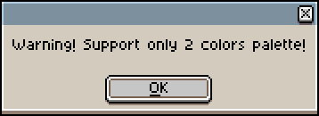
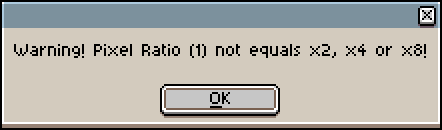
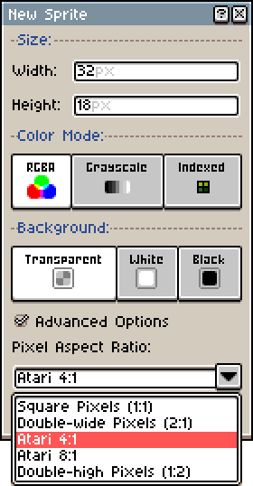
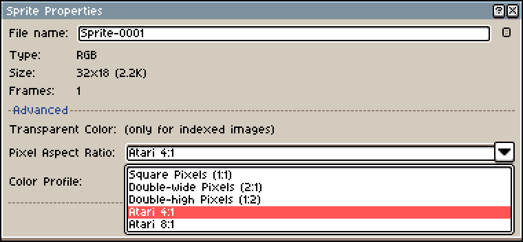
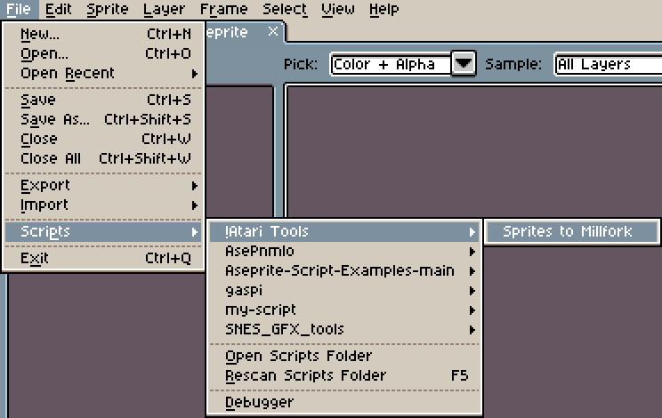
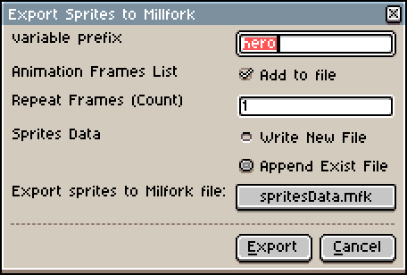
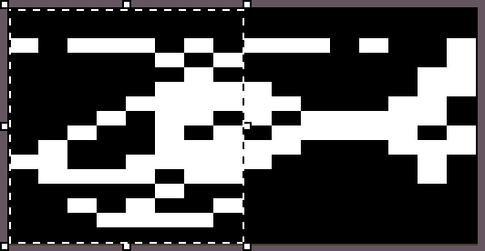

# Aseprite-Scripts

A set of scripts "!Atari Tools" that make working with the Aseprite graphic editor easier. At the moment, the project only includes one script "Sprites to Millfork", but other utilities are planned for the future.

## Sprites to Millfork

### Introduction

As the name suggests, this script allows you to get graphic data (sprites) from Aseprite in mfk text format for further use when building your projects using Millfork.

In its structure, it is close to the C format and is a sequential recording of bytes in the form of an array **array(byte)**.

Since Atari sprites are one-bit (dot present / no dot present), when analyzing the image, all layers are glued together into a single image and if the color is **RGB(#000000)**, then it is considered that there is no dot, otherwise any other color is perceived as a dot.

Despite this fact, if there are more than 2 colors, you will receive a warning when calling the script. This does not affect the logic of the work, but warns why all the colors suddenly became one.



It is also worth noting that the sprite in Atari has several options for aspect ratio. Usually it is 2:1 (normal), but 4:1 (double) or even 8:1 (quadruple) are possible. Therefore, if another option is selected, you will also receive a warning:



### Aseprite improvement

Aseprite initially supports only 2:1 aspect ratio, but you can add the other two (4:1 and 8:1) yourself.

To do this, open the directory where your copy of Aseprite is installed. For example, if it is the Steam version, the path will be:

`SteamLibrary\steamapps\common\Aseprite\data\widgets\`

Next, you need to find two files **new_sprite.xml** and **sprite_properties.xml** and in the pixel_ratio section add new entries, for example like this:

```xml
<combobox id="pixel_ratio" cell_align="horizontal">
          <listitem text="@.square_pixels" value="1:1" />
          <listitem text="@.double_wide" value="2:1" />
          <listitem text="Atari 4:1" value="4:1" />
          <listitem text="Atari 8:1" value="8:1" />
```

the same in the second file:

```xml
<combobox id="pixel_ratio" cell_align="horizontal">
        <listitem text="@.square_pixels" value="1:1" />
        <listitem text="@.double_wide" value="2:1" />
        <listitem text="@.double_high" value="1:2" />
        <listitem text="Atari 4:1" value="4:1" />
        <listitem text="Atari 8:1" value="8:1" />
```

After restarting the editor, we will have new menu items:





In addition to single sprites, the script allows you to unload a whole group (animation) as an array of pointers **array(pointer)** to frames (arrays of sprites) and the duration (delay) for each frame as an array **array(byte)**

Since the script was developed to prepare data for my project "AirWolf(Prototype)", the frame delays were selected in such a way that the animation playback would be less similar both in Aseprite and on a real Atari.

### Installation

To add a script to Aseprite, you need to open the settings directory. Under Windows, this will look like this:

`c:\Users\%USERNAME%\AppData\Roaming\Aseprite\scripts\`

Copy “**!Atari Tools**” into this directory, then in Aseprite (if it was already running) press “F5” (Rescan Script Folder).

After which, the script lists should show a picture like this:



### Settings

After run the script, an additional window with settings will open:



***Variable prefix*** - this is a prefix for the variable (array) name that will be used when creating data. Usually it is taken from the name of the Aseprite working file, but you can set an arbitrary value. For example, when using the name "hero" the following names will be used:

```c
byte heroSize
array(byte) heroSpr1a
array(byte) heroSpr2a
array(pointer) heroFramesAni2
array(byte) heroFramesDuration
```

***Animation Frames List*** - if this checkbox is active, then all animation frames will be added to the final file, otherwise there will be only sprite data.

***Repeat Frames (Count)*** - the number of repetitions for the animation. In normal mode (1), frames are repeated only 1 time, but you can set an arbitrary number.

***Sprites Data*** - file writing mode, you can either create a new file "*Write New File*" (only with the data of the current sprite), or append "*Append Exist File*" to an existing one with the data of other sprites.

***Export sprites to Milfork file*** - the actual file name and its location on the disk. By default, this is "*spritesData.mfk*", but you can specify any file.

### Structure

As was said earlier, the script was written for my own project and after saving the file "*spritesData.mfk*", the structure will look like this:

`byte heroSize = 0`

This is where the aspect ratio for atari sprites is stored: 0 - normal (ratio 2:1), 1 - double (ratio 4:1) and 3 - quadruple (ratio 8:1)

```c
// Sprite 1 16x16
array(byte) heroSpr1a = [0x00, … , 0x00]
// Sprite 2 16x16
array(byte) heroSpr2a= [0x00, … , 0x00]
```

Since the width of 1 sprite in Atari is rigidly set and equals 8, then the sprite data is 1 byte per line. If the sprite width is greater than 8, then the script assumes that you want to use 2 sprites at once and therefore immediately prepares data for the second. For example, like this chopper:



Depending on the number of animation frames, other data will be created, such as:

```c
array(byte) heroSpr1b
array(byte) heroSpr2b
array(byte) heroSpr1c
array(byte) heroSpr2c
array(byte) heroSpr1d
array(byte) heroSpr2d
```

Next, an array with pointers to frames will be added, separately for the 1st part of the sprite and separately for the 2nd:

```c
// Sprite 1 Frame Animation
array(pointer) heroFramesAni1 = [
    heroSpr1a, heroSpr1b, heroSpr1c, heroSpr1d, heroSpr1e
]`
// Sprite 2 Frame Animation
array(pointer) heroFramesAni2 = [
    heroSpr2a, heroSpr2b, heroSpr2c, heroSpr2d, heroSpr2e
]
```

And finally, one more array for the duration of animation frames:

```c
// Sprite Frame Duration
array(byte) heroFramesDuration = [
        1, 1, 1, 1, 1
]
```

### License

Source Copyright © 2024 Breeze\Fishbone and contributors. Distributed under the BSD License. See the file LICENCE.
