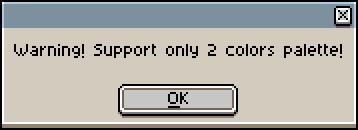
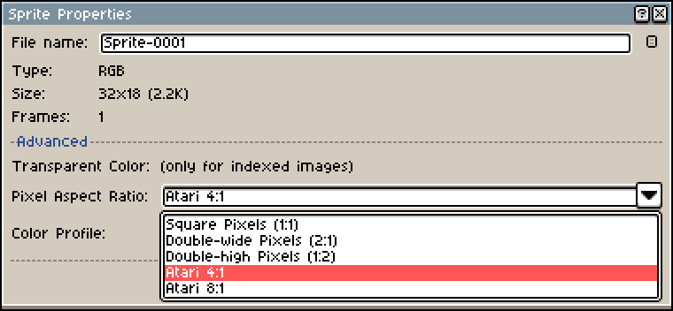
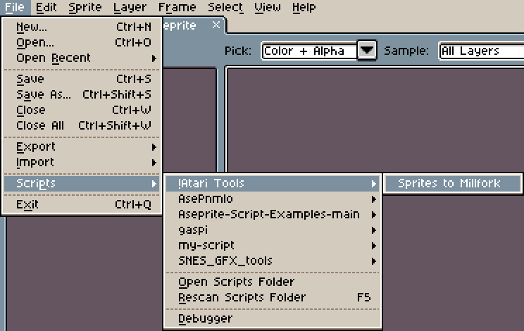
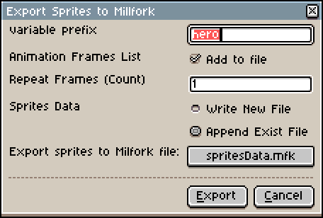

# Aseprite-Scripts

Набор скриптов «!Atari Tools» облегчающих работу с графическим редактором Aseprite. На данный момент в составе проекта лишь один скрипт «Sprites to Millfork», но в будующем планируются и другие утилиты.

## Sprites to Millfork

### Введение

Как ясно из названия, этот скрипт позволяет получить графические данные (спрайты) из Aseprite в текстом формате mfk для дальнейшего использования при сборке своих проектов с помощью Millfork.

По своей структуре это близко к формату C и представляет собой последовательную запись байтов в виде массива **array(byte)**.

Поскольку в Atari спрайты однобитные (есть точка / нет точки), то при анализе изображения все слои склеиваются в единую картинку и если цвет **RGB(#000000)**, то считается, что точка отсутствует, в противном случае любой другой цвет воспринимается как точка.

Не смотря на этот факт, если цветов более чем 2, при вызове скрипта вы получите предупреждение. Это никак не влияет на логику работы, но предупреждает почему все цвета вдруг стали одним.

Так же стоит заметить, что спрайт в Atari имеют несколько вариантов соотношения сторон. Обычно это 2:1 (normal), но возможен 4:1 (double), или даже 8:1 (quadruple). Поэтому если выбран иной вариант, то вы так же получите предупреждение:

### Доработка Aseprite

Изначально в Aseprite поддерживается только соотношение сторон 2:1, однако можно самостоятельно добавить другие два (4:1 и 8:1).

Для этого нужно открыть директорию где установлена ваша копия Aseprite. Например если это Steam-версия, то путь будет:

`SteamLibrary\steamapps\common\Aseprite\data\widgets\`

Далее нужно найти два файла **new_sprite.xml** и **sprite_properties.xml** и в разделе pixel_ratio добавляем новые записи, например так:

`<combobox id="pixel_ratio" cell_align="horizontal">
          <listitem text="@.square_pixels" value="1:1" />
          <listitem text="@.double_wide" value="2:1" />
          <listitem text="Atari 4:1" value="4:1" />
          <listitem text="Atari 8:1" value="8:1" />
`

тоже самое во втором файле:

`<combobox id="pixel_ratio" cell_align="horizontal">
        <listitem text="@.square_pixels" value="1:1" />
        <listitem text="@.double_wide" value="2:1" />
        <listitem text="@.double_high" value="1:2" />
        <listitem text="Atari 4:1" value="4:1" />
        <listitem text="Atari 8:1" value="8:1" />
`

После перезапуска редактора у нас появятся новые пункты меню:

Помимо одиночных спрайтов, скрипт посволяет выгрузить целую группу (анимацию) в виде массива указателей **array(pointer)** на кадры (массивы спрайтов) и продолжительность (задержка) для каждого кадра в виде массива **array(byte)**

Поскольку скрипт разрабатывался для подготовки данных для моего проекта «AirWolf(Prototype)», то задержки кадров были подобраны таким образом, что бы было боллее менее похоже воспоизведение анимации как в Aseprite, так на реальном Atari.

### Установка

Для того, что бы добавить скрипт в Aseprite, нужно открыть директорию с настройками. Под Windows это будет в виде:

`c:\Users\%USERNAME%\AppData\Roaming\Aseprite\scripts\`

В эту директорию копируем «**!Atari Tools**», затем в Aseprite (если он был уже запущен) нажимаем «F5» (Rescan Script Folder).

После чего в списках скриптов должна получится вот такая картинка:

### Настройки

После вызова скрипта, откроется дополнительное окно с настройками:

***Variable prefix*** - это префикс для названия переменных (массивов) которое будет использовано при создании данных. Обычно оно берётся из имени рабочего файла Aseprite, но вы можете задать произвольное значение. Например, при использовании названия «hero» будут такие имена:

`byte heroSize`
`array(byte) heroSpr1a`
`array(byte) heroSpr2a`
`array(pointer) heroFramesAni2`
`array(byte) heroFramesDuration`

***Animation Frames List*** - если активен этот чекбокс, то в конечный файл будут добавлены все кадры анимации, в противном случает будут лишь данные спрайта.

***Repeat Frames (Count)*** - количество повторений для анимации. В обычном режиме (1), кадры повторяются лишь 1 раз, но можно задать произвольное количество.

***Sprites Data*** - режим записи файла, можно как создать новый файл «*Write New File*» (только с данными текущего спрайта), так и дописать «*Append Exist File*» уже существующий с данными других спрайтов.

***Export sprites to Milfork file*** - собственно название файла и его месторасположение на диске. По умолчанию это «*spritesData.mfk*», но вы можете указать произвольный файл.

### Структура

Как уже было сказано ранее, скрипт писался под свой и проект и после сохранения файла «*spritesData.mfk*», структура будет иметь следующий вид:

`byte heroSize = 0`

Здесь хранится соотношение сторон для атари спрайтов: 0 - normal (соотношение 2:1), 1 - double (соотношение 4:1) и 3 - quadruple (соотношение 8:1)

`// Sprite 1 16x16`
`array(byte) heroSpr1a = [0x00, … , 0x00]`
`// Sprite 2 16x16`
`array(byte) heroSpr2a= [0x00, … , 0x00]`

Поскольку ширина 1 спрайта в Atari, жостко задана и равняется 8, то данные спрайта по 1 байту на линию. Если же ширина спрайта больше 8, то скрипт подразумевает, что вы ходите задествовать сразу 2 спрайта и поэтому сразу подготавливает данные для второго. Например как у этого вертолёта:

В зависимости от количества кадров анимации будут созданы и другие даные, например:

`array(byte) heroSpr1b`
`array(byte) heroSpr2b`
`array(byte) heroSpr1c`
`array(byte) heroSpr2c`
`array(byte) heroSpr1d`
`array(byte) heroSpr2d`

Далее будет добавлен массив с указателями на кадры, отдельно для 1й части спрайта и отдельно для 2й:

`// Sprite 1 Frame Animation`
`array(pointer) heroFramesAni1 = [`
`    heroSpr1a, heroSpr1b, heroSpr1c, heroSpr1d, heroSpr1e`
`]`
`// Sprite 2 Frame Animation`
`array(pointer) heroFramesAni2 = [`
`    heroSpr2a, heroSpr2b, heroSpr2c, heroSpr2d, heroSpr2e`
`]`

И в заключении ещё один массив для продолжительности кадров анимации:

`// Sprite Frame Duration`
`array(byte) heroFramesDuration = [`
`        1, 1, 1, 1, 1`
`]`

### License

Source Copyright © 2024 Breeze\Fishbone and contributors. Distributed under the BSD License. See the file LICENCE.
